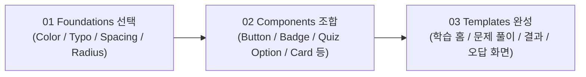
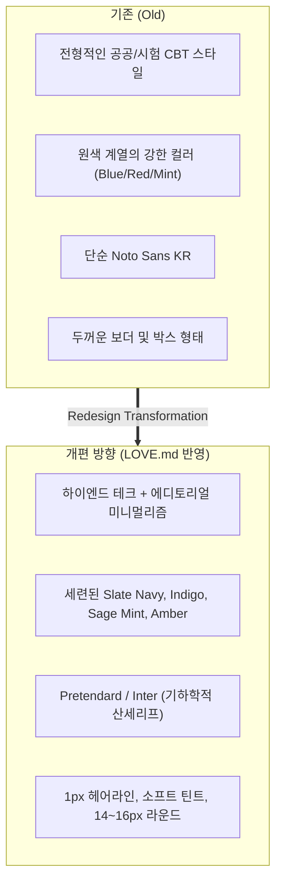
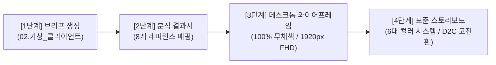

# 📘 AI ACE CBT Learning UI Kit 스타일가이드 및 리서치 분석 보고서

---

# [PART 1] 기존 스타일가이드 분석 (AI ACE CBT Learning UI Kit)

> **버전:** 1.0 (Community UI Kit)  
> **기반 프로젝트:** AI ACE CBT Learning UI Kit  
> **목적:** 시험 및 학습 경험을 위한 웹 기반 디자인 시스템 (Foundations · Components · Quiz States · Responsive Templates)

---

## 1. 개요 및 워크플로우

본 디자인 시스템은 웹 기반 CBT(Computer-Based Testing) 및 AI 시험/학습 플랫폼을 위해 구축된 디자인 가이드입니다.

* **Figma Variables & Auto Layout**: 유연한 컴포넌트 확장성 및 오토레이아웃 지원
* **Theme 전환**: Primitives 토큰과 Semantic 토큰 분리를 통한 Light / Dark 모드 대응
* **반응형 웹(Responsive Web)**: Desktop, Tablet, Mobile 환경 지원
* **접근성(Accessibility)**: 최소 터치 영역 44px, Focus 2px 외곽선 규격 준수

---

## 2. Foundations (기초 디자인 토큰)

### 🎨 Colors (색상 체계)

#### 1) Primitives (원시 팔레트)
| 분류 | 색상 토큰 변수명 | 사용 목적 |
| :--- | :--- | :--- |
| **Base** | `var(--ace-white-1000)` `var(--ace-black-1000)` | 기본 흑백 베이스 |
| **Navy** | `var(--ace-navy-50)` ~ `var(--ace-navy-900)` | 다크 테마 배경, 깊이감 있는 캔버스/서피스 |
| **Blue** | `var(--ace-blue-100)` ~ `var(--ace-blue-700)` | 메인 브랜드 컬러, 주요 인터랙션 |
| **Mint** | `var(--ace-mint-100)` ~ `var(--ace-mint-800)` | 성공(Success), 정답(Correct), 완료 상태 |
| **Orange** | `var(--ace-orange-100)` ~ `var(--ace-orange-800)` | 경고(Warning), 검토 필요(Review) 상태 |
| **Red** | `var(--ace-red-100)` ~ `var(--ace-red-700)` | 위험(Danger), 오답(Incorrect) 상태 |
| **Gray** | `var(--ace-gray-50)` ~ `var(--ace-gray-900)` | 비활성, 보더, 중립 텍스트 및 서브 배경 |

#### 2) Semantic Colors (의미론적 토큰 - Light/Dark 대응)
* **Background (`color/bg/*`)**:
  * `canvas`: 기본 캔버스 배경
  * `surface`: 카드 및 모듈 컨테이너 배경
  * `subtle`: 부드러운 강조 배경
  * `brand` / `brand-hover`: 브랜드 메인 액션 배경
  * `selected`: 선택된 상태 배경
  * `review`: 검토 대상 배경 (Orange 틴트)
  * `success` / `success-strong`: 정답 및 통과 배경
  * `danger` / `danger-strong` / `danger-hover`: 오답 및 마감 임박 배경
  * `disabled`: 비활성 요소 배경
* **Border (`color/border/*`)**:
  * `default`, `strong`, `brand`, `focus` (2px), `danger`
* **Text (`color/text/*`)**:
  * `primary`, `secondary`, `muted`, `brand`, `on-brand`, `success`, `warning`, `danger`
* **Icon (`color/icon/*`)**:
  * `default`

---

### 🔤 Typography (타이포그래피)
* **기본 폰트**: `Noto Sans KR` (한국어 가독성 및 학습 집중도 최적화)

| 계층 (Token Name) | Font Weight | Font Size | Line Height | 주 용도 |
| :--- | :--- | :--- | :--- | :--- |
| **Display/Large** | Bold | 48px | 60px | 메인 타이틀, 히어로 섹션 |
| **Heading/1** | Bold | 36px | 48px | 대단원, 주요 대제목 |
| **Heading/2** | Bold | 28px | 40px | 중제목, 모달 타이틀 |
| **Heading/3** | Bold | 22px | 32px | 소제목, 카드 헤더 |
| **Title/Large** | Bold | 20px | 28px | 문제 제목, 주요 레이블 |
| **Title/Medium** | Medium | 18px | 26px | 중간 강조 문구 |
| **Body/Large** | Regular | 16px | 24px | 본문 기본, 지문 텍스트 |
| **Body/Medium** | Regular | 14px | 22px | 보조 설명, 문제 선택지 텍스트 |
| **Body/Small** | Regular | 13px | 20px | 부가 정보, 캡션 본문 |
| **Label/Large** | Medium | 14px | 20px | 버튼 및 뱃지 레이블 (Large) |
| **Label/Medium** | Medium | 12px | 18px | 폼 레이블, 뱃지 레이블 (Medium) |
| **Caption** | Regular | 11px | 16px | 부가 설명, 하단 도움말 |
| **Timer** | Bold | 20px | 28px | **고정폭 카운트다운 타이머 전용** |

---

### 📏 Spacing & Sizing (간격 및 크기 규칙)

* **Base Unit**: **8px Grid** (4px 하프 스텝 지원)
* **Spacing Scale**:
  * `spacing/0` (0px)
  * `spacing/4` (4px)
  * `spacing/8` (8px)
  * `spacing/12` (12px)
  * `spacing/16` (16px)
  * `spacing/20` (20px)
  * `spacing/24` (24px)
  * `spacing/32` (32px)
  * `spacing/40` (40px)
  * `spacing/48` (48px)
  * `spacing/64` (64px)

* **Control & Touch Size (컨트롤 및 터치 규격)**:
  * `size/control/small`: 32px
  * `size/control/medium`: 40px
  * `size/control/large`: 48px
  * `size/touch/minimum`: **44px** (모바일 터치 접근성 최소 기준)

* **Component Sizing Metrics**:
  * `stroke/1` (1px) / `stroke/2` (2px)
  * `size/badge/small`: 24px
  * `size/progress/track`: 12px
  * `size/option/minimum`: 64px (문제 보기 최소 높이)

---

### 🔘 Radius & Effects (라운드 및 그림자)

* **Radius Scale**:
  * `radius/0` (0px), `radius/4` (4px), `radius/8` (8px), `radius/12` (12px), `radius/16` (16px), `radius/24` (24px), `radius/full` (Pill/원형)

* **Shadow Styles**:
  * `AI ACE CBT/Shadow/Card`: `Y: 2px` · `Blur: 8px` · `Opacity: 8%` (기본 카드 서피스)
  * `AI ACE CBT/Shadow/Floating`: `Y: 8px` · `Blur: 24px` · `Opacity: 12%` (드롭다운, 플로팅 버튼)
  * `AI ACE CBT/Shadow/Overlay`: `Y: 16px` · `Blur: 40px` · `Opacity: 16%` (모달, 오버레이 다이얼로그)

---

## 3. Components (기본 컴포넌트 명세)

### 1. Button (버튼)
* **구성**: `Size 2종` × `Style 3종` × `State 4종` = **총 24개 Variants**
* **Styles**:
  1. `Primary (Filled)`: 메인 액션 (다음 문제, 제출 등)
  2. `Secondary (Outlined)`: 보조 액션 (이전 문제, 초기화 등)
  3. `Danger (Destructive)`: 위험/종료 액션 (시험 종료, 리셋 등)
* **States**: `Default`, `Hover`, `Active/Focus` (Focus Ring 2px), `Disabled`
* **Accessibility**: 최소 높이 40px 이상 보장

### 2. Badge (배지)
* **구성**: `Size 2종` × `Tone 5종` = **총 10개 Variants**
* **Tones**: `Neutral (Gray)`, `Brand (Blue)`, `Success (Mint)`, `Warning (Orange)`, `Danger (Red)`
* **가이드**: 짧은 명사형 문구 사용 (예: "진행중", "정답", "난이도 상")

### 3. Progress (진행률 바)
* **구성**: `Value 5단계` × `Tone 2종` = **총 10개 Variants**
* **Tones**: `Brand Blue` (진행 상태), `Success Mint` (학습 완료 상태)
* **규격**: 높이 12px, 풀 라운드 형태의 바

### 4. Question Number (문항 번호 컨트롤)
* **구성**: `Size 2종` × `State 6종` = **총 12개 Variants**
* **States**:
  1. `미응답 (Default)`: 기본 서클 + 숫자
  2. `현재 풀이 (Active)`: 솔리드 블루 + 화이트 숫자
  3. `응답 완료 (Answered)`: 블루 외곽선 + 블루 숫자
  4. `정답 (Correct)`: 민트 배경 + 녹색 숫자
  5. `오답 (Incorrect)`: 레드 배경 + 붉은 숫자
  6. `검토 필요 (Review)`: 오렌지 배경 + 오렌지 숫자
* **Accessibility**: 최소 40px 터치 영역 유지

### 5. Quiz Option (객관식 보기 컴포넌트)
* **구조**: `[좌측 원형 Prefix (A, B, C, D)]` + `[우측 내용 Label]`
* **States (8종)**:
  * `Default`, `Hover`, `Selected`, `Focus` (2px 보더)
  * `Correct` (정답-민트), `Incorrect` (오답-레드), `Disabled` (비활성), `Review` (검토-오렌지)
* **규격**: 최소 높이 64px로 넉넉한 터치/클릭 영역 확보

### 6. Timer (타이머)
* **구성**: `Default`, `Warning`, `Danger` 3단계 상태
* **특징**:
  * 정상 진행: 기본 텍스트 및 프레임
  * 시간 임박: 오렌지 톤 경고
  * 마감 직전: 레드 톤 위험 피드백
  * Noto Sans KR Bold 20px 기반 고정폭 시간 포맷(`00:24:36`) 제공

### 7. Card (카드 컨테이너)
* **구성**: 4가지 템플릿 서피스
  1. `Base`: 기본 흰 배경 + 카드 섀도우
  2. `Stat`: 대시보드 통계 및 수치 강조용 (블루 테두리)
  3. `Explanation`: 문제 해설 및 오답 노트 전용 (소프트 블루/라벤더 배경)
  4. `Result`: 채점 결과 및 통과 안내용 (소프트 민트 배경)

---
---

# [PART 2] LOVE.md 디자인 리서치 분석 및 개편 방향성

> **분석 대상 파일:** `LOVE.md` (사용자 선호 디자인 레퍼런스 9선)  
> **컨셉 키워드:** `Editorial Tech`, `Minimal Luxury`, `Refined Modernism`

---

## 1. LOVE.md 레퍼런스별 디자인 특성 분석

| 구분 | 레퍼런스 | 주요 UI/UX 디자인 특징 | 본 시스템 적용 방안 |
| :--- | :--- | :--- | :--- |
| **Tech & AI** | **나니아랩스 (Narnia.ai)** | 딥 제너레이티브 AI 테크 무드, 정밀한 그리드 라인 데코, 바코드/데이터 라벨, 네온·시안·퍼플 액센트 | 타이머, 문항 인디케이터, 테크니컬 메트릭 데이터 시각화 |
| **Interaction** | **Behance (New Works)** | 부드러운 스무스 스크롤, 감각적인 카드 마이크로 인터랙션, 미세 스케일/글로우 효과 | 보기(Quiz Option) 선택 및 버튼 Hover 인터랙션 |
| **Luxury Minimal** | **마데키엘 (madechiel)** | 1px의 섬세한 헤어라인 보더, 기하학적 영문 폰트(Jost, Montserrat), 넉넉한 여백, 고급 흑백 대비 | 카드 컨테이너의 얇고 세련된 외곽선, 넓은 자간/행간 호흡 |
| **Editorial Brand** | **Behance (Court Watches)** | 럭셔리 워치 브랜드의 미니멀리즘, 정교한 그리드 시스템, 절제된 레이아웃 | 통계/결과 카드 및 대시보드 레이아웃 |
| **Calm & Organic** | **티센트 (tscent-tea)** | 동양적 절제미, 웜 베이지/얼스톤 틴트, 클래식과 모던의 조화로운 여백 | 눈의 피로도를 낮추는 부드러운 캔버스 배경톤 (`#F8FAFC`) |
| **Lifestyle Curation** | **굳닷컴 (guud.com)** | 신세계 까사의 모던 매거진 스타일 큐레이션, 깔끔한 모듈 카드, 둥근 모서리(12~16px) | 문제 풀이 영역의 모듈화된 카드 UI 구성 |
| **Color Therapy** | **뮤끄 (muque.co.kr)** | 컬러 테라피 뷰티 브랜드, 감각적인 파스텔 & 뮤티드 비비드 포인트 컬러, Pretendard 폰트 | 촌스럽지 않은 세이지 민트, 앰버 골드, 코랄 레드 컬러 팔레트 |
| **Classic Heritage** | **파리크라상** | 프리미엄 베이커리, 네이비/골드/아이보리 클래식 럭셔리 톤 | 메인 브랜드 컬러의 깊이감 있는 딥 슬레이트 네이비 구축 |
| **Clean Healthcare** | **안국건강 (shopagh)** | 군더더기 없는 클린 레이아웃, 높은 정보 가독성, 정갈한 인포메이션 아키텍처 | 정돈된 텍스트 계층 구조 및 문제 해설 가독성 확보 |

---

## 2. 디자인 DNA 추출 및 기존 대비 개편 방향

---

## 3. 리디자인 토큰 및 컴포넌트 설계 명세 (초안)

### 🎨 Color Palette Redesign
1. **Primary Brand**: Deep Slate Navy (`#0F172A`) & Electric Indigo (`#4F46E5`, `#3B82F6`)
2. **Surface & Canvas**:
   * `Canvas Background`: `#F8FAFC` (눈이 편안한 소프트 슬레이트)
   * `Surface Card`: `#FFFFFF` (1px 헤어라인 `#E2E8F0` + 미세 글로우 섀도우)
   * `Surface Subtle`: `#F1F5F9`
3. **Semantic Status Colors**:
   * `Success / Correct`: **Sage Mint (`#10B981` / `#ECFDF5`)**
   * `Warning / Review`: **Amber Gold (`#F59E0B` / `#FFFBEB`)**
   * `Danger / Incorrect`: **Coral Crimson (`#EF4444` / `#FEF2F2`)**

### 🔤 Typography Redesign
* **Font Family**: `Pretendard`, `Inter` (한글/영문 최적화 폰트)
* **특징**:
  * 문제 본문: `Line Height 170%`로 지문 가독성 극대화
  * 타이머 및 문항 번호: `Tabular Figures (고정폭 숫자)` 적용

### 📏 Radius & Borders
* `Radius`: 카드/컨테이너 `14px` ~ `16px`, 버튼 `10px`, 뱃지 `Full Pill (9999px)`
* `Border`: `1px solid rgba(226, 232, 240, 0.8)` 헤어라인 보더

---

## 4. 컴포넌트 리디자인 가이드

1. **Quiz Option (객관식 보기)**:
   * 1px 라이트 보더 + 좌측 미니멀 원형 알파벳 인덱스 (A, B, C, D)
   * Hover 시 부드러운 인디고 보더 전환 및 미세 스케일 피드백
   * Correct(세이지 민트) / Incorrect(코랄 레드) 틴트 배경 적용
2. **Timer (타이머)**:
   * Narnia 테크 감성의 캡슐형 플로팅/인라인 타이머 (`00:24:36`)
   * 시간 임박 시 은은한 앰버/레드 펄스 글로우 적용
3. **Question Number (문항 네비게이터)**:
   * 40px 미니멀리스트 원형 버튼 (현재 문제: 인디고 솔리드 + 글로우)
4. **Card Container**:
   * 에디토리얼 매거진 스타일의 여유로운 패딩(28px)과 깔끔한 헤어라인 디바이더

---
---

# [PART 3] 가상 클라이언트 자동화 설계 스킬 분석 및 웹디자인 규격

> **분석 대상 파일:** `03.가상클라이언트_자동화_SKILL.md`  
> **핵심 설계 규격:** 1920px FHD 데스크톱 퍼스트 · 하이엔드 어반 웰니스 6대 컬러 시스템 · D2C 고전환 표준

---

## 1. 4단계 자동 실행 파이프라인 개요

가상 클라이언트 지정 시 기획 브리프부터 고충실도 D2C 웹 스토리보드까지 단계별 산출물을 일관되게 생성하는 표준 파이프라인입니다.

| 단계 | 산출물 위치 및 파일 형식 | 핵심 설계 규칙 |
| :--- | :--- | :--- |
| **1단계: 브리프** | `02.가상_클라이언트/<이름>.md` | 9대 표준 규격에 맞춘 클라이언트 요구사항 명세 |
| **2단계: 분석서** | `03.가상클라이언트_분석_결과/<이름>_결과.md` | 시장 타겟 및 8개 레퍼런스 비교 분석 |
| **3단계: 와이어프레임** | `05.와이어프레임_결과/<이름>/` | • **100% 저충실도 무채색** (White, Gray `#F5F5F5`, Black `#222222`) • 네온/형광/그라디언트 배제, 정보 위계 및 동선 집중 • 사이트맵, 서비스 흐름도, 화면 설계서, `와이어프레임.html` |
| **4단계: 스토리보드** | `04.스토리보드_결과/<폴더>/` | • **1920px 데스크톱 웹 기준** & **6대 브랜드 컬러 시스템** 반영 • 10개 섹션 대상 10대 표준 항목 명세 (.html / .md) |

---

## 2. 1920px 데스크톱 퍼스트 레이아웃 표준

* **해상도 기준**: **1920px (FHD) 데스크톱 웹사이트** (콘텐츠 그리드: **1200px ~ 1440px**)
* **구조적 특징**:
  * **상단 Full-Width GNB**: 브랜드 로고, 네비게이션 메뉴, 액션 버튼의 시원한 가로 배치
  * **좌우 Split Hero**: 좌측 강력한 문제 해결형 텍스트 + 우측 웰니스 비주얼/인터랙션 뷰어
  * **3~4열 카드 그리드**: 데스크톱 화면 비율을 적극 활용한 여유로운 모듈 배치
  * **대시보드형 시각화**: 식비/시간 절감 데이터 저울, 맞춤 진단 결과 인터랙션

---

## 3. 하이엔드 어반 웰니스 6대 브랜드 컬러 시스템

스토리보드 및 실제 웹디자인 구현 시 적용되는 핵심 컬러 토큰입니다.

| 구분 | 컬러명 (Label) | HEX Code | RGB / CMYK | 주요 적용 영역 |
| :---: | :--- | :---: | :---: | :--- |
| **Primary** | **Deep Forest Green** | `#183D33` | `R 24 G 61 B 51` `C 85 M 40 Y 75 K 65` | **메인 브랜드 컬러** • 헤더 로고, 메인 헤드라인, 신뢰감 부여 영역 |
| **Background** | **Cream White** | `#FAF6EB` | `R 250 G 246 B 235` `C 2 M 3 Y 8 K 0` | **기본 배경 & 40%+ 여백** • 눈이 편안한 웰니스 톤 (의약품 느낌 배제) |
| **Accent** | **Vital Sage Green** | `#76A58C` | `R 118 G 165 B 140` `C 50 M 15 Y 45 K 5` | **핵심 CTA & 활력 포인트** • '10초 컷 맞춤 구독하기' 버튼, 활력 배지, 호버 링 |
| **Natural** | **Dark Walnut Brown** | `#503323` | `R 80 G 51 B 35` `C 40 M 65 Y 75 K 60` | **서브 내추럴 포인트** • 우드 오브제 감성 섹션, 라이프스타일 큐레이션 |
| **Grid/Text** | **Charcoal Gray** | `#4C4E52` | `R 76 G 78 B 82` `C 65 M 55 Y 55 K 35` | **본문 텍스트 & 구조 라인** • 본문 문구, 카드 보더, 디바이더 라인 |
| **Urban** | **Dark Navy** | `#2A3C5A` | `R 42 G 60 B 90` `C 85 M 70 Y 35 K 30` | **비즈니스 & 오피스 루틴** • B2B 플랜, 텀블러/오피스 루틴 강조 배지 |

---

## 4. D2C 고전환 5대 핵심 원칙 및 화면 아키텍처

### 1) D2C 고전환 5대 원칙
1. **문제 해결형 카피**: 일상 속 결핍과 불편함을 3초 안에 타격하는 직관적 헤드라인 전개
2. **가격/구독 혜택 시각화**: 정가 대비 할인율(%) 및 정기구독 시 식비·시간 절감 계산기 배치
3. **수치 데이터 전면화**: 92.4% 흡수율, 위 자극 0% 등 정량적 임상/인증 데이터 배지 노출
4. **완급 조절 5단계 구조**: `Hero` ➔ `3대 원칙` ➔ `1:1 맞춤 진단` ➔ `비교/리뷰` ➔ `간편 구독 CTA`
5. **지정 산출물 일괄 동기화**: HTML, MD, JSON 등 지정된 산출물 형식의 일괄 동기화 유지

### 2) 화면별 핵심 명세 (화면 시리즈)
* **메인페이지 (SCR)**: `SCR-100(통합홈)` ➔ `SCR-110(목적진단)` ➔ `SCR-120/121(컬렉션)` ➔ `SCR-130(제품탐색)` ➔ `SCR-150(맞춤구성)` ➔ `SCR-190(접수/신청)`
* **브랜드소개 (BRD)**: `BRD-100(철학)` ➔ `BRD-110(문제/해법)` ➔ `BRD-120(5단계 공정)` ➔ `BRD-130(순환/리필)` ➔ `BRD-140(검증 근거와 한계)`
* **카테고리/제품 (CAT)**: `CAT-100(통합탐색)` ➔ `CAT-110(목적별 비교)` ➔ `CAT-120(제품상세)` ➔ `CAT-130(결과없음)`
* **공통 5대 상태(State)**: 모든 화면은 ① 기본, ② 로딩(스켈레톤), ③ 빈 상태(대안 제시), ④ 오류(대체 링크), ⑤ 완료 상태를 필수 정의.

### 3) 4대 유즈케이스 다변화
1. **본인 직접 섭취/구매**: 식비/시간 절감 데이터 저울 UI + 1:1 맞춤 진단 분석 + 라벨 각인 3D 프리뷰
2. **선물하기**: 선물 수령인 전용 웰니스 카드 UI + 축하 메시지 라벨 폼 + 럭셔리 패키징 뷰어
3. **B2B / 기업 복지**: 임직원 복지 수량별 할인율 표 + 기업 응원 문구 일괄 라벨링 + 견적서 다운로드
4. **전문가 큐레이션/제휴**: 임상 검증 차트 + 전문가 처방 알고리즘 연동 + 프로 처방 라벨 UI

---

## 5. 스타일가이드(Editorial Tech)와의 웹디자인 융합 전략

앞서 도출한 **[PART 2]의 Editorial Tech 스타일가이드**와 **[PART 3]의 어반 웰니스 D2C 설계 원칙**을 결합하여 다음과 같이 웹디자인을 전개합니다.

1. **타이포그래피 & 여백**: `Pretendard` 서체 + 넉넉한 40%+ 크림 화이트(`FAF6EB`) 여백으로 에디토리얼 무드 구현
2. **컴포넌트 디테일**: 1px 섬세한 헤어라인 보더(`rgba(76, 78, 82, 0.2)`)와 14~18px 곡률, 세련된 Full Pill 뱃지 적용
3. **인터랙션 & 데이터 시각화**: Narnia/Tech 스타일의 정교한 데이터 저울 UI 및 카운트다운 타이머 인터랙션 결합
